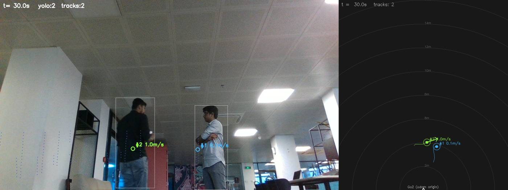
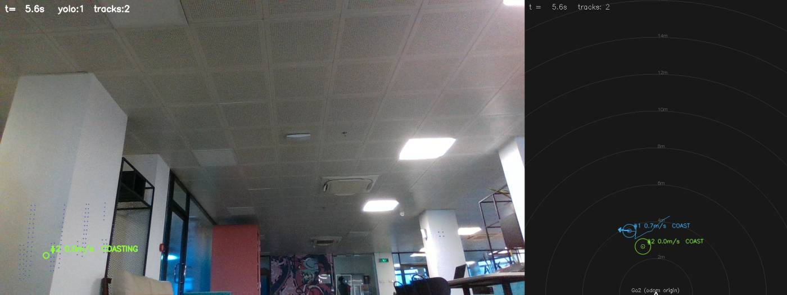

# Go2 Social Navigation — Containerized Simulation Environment

Containerized **ROS 2 Humble + Gazebo Classic 11** simulation environment for
Unitree Go2 social navigation research.

Everything runs inside Docker. The host provides only Docker + GUI forwarding;
the host's own ROS installation is never used.

## Why containerized

- **Host:** Ubuntu 24.04 (ROS 2 Jazzy native — unused here).
- **Target robot:** Unitree Go2 EDU, Jetson Orin NX, JetPack 5.1.1 (Ubuntu
  20.04, ROS 2 Foxy native). We develop in **Humble** so the codebase ports to
  Foxy via a thin bridge node on the robot later.
- Gazebo Classic 11 is EOL on Ubuntu 24.04 — containerizing gives us the
  Humble + Gazebo Classic 11 combo cleanly on a modern host.

## Hardware / GPU notes

- **This laptop:** no NVIDIA GPU — only Intel Raptor Lake-P UHD Graphics. The
  default compose config uses **Intel iGPU** acceleration via `/dev/dri`.
- **Desktop PC / Orin (later):** have NVIDIA GPUs. Use the `nvidia` profile
  (`PROFILE=nvidia ./run.sh ...`), which requires `nvidia-container-toolkit`
  on that host.
- **Display:** the host runs a Wayland session; Gazebo (an X11 app) renders
  through Xwayland. `run.sh` handles X11 authorization automatically.

## Layout

```
docker/
  Dockerfile        # osrf/ros:humble-desktop + Gazebo Classic 11 + tools
  entrypoint.sh     # sources ROS + workspace overlay
ros2_ws/src/        # our ROS 2 packages (live bind-mount into the container)
  tracking/         # THE canonical Track contract + tracker (pure stdlib, no ROS)
  fusion_lab/       # real-perception producer: LiDAR+camera fusion, bag replay
docs/images/        # showcase stills used by this README
docker-compose.yml  # service def: host net, X11, /dev/dri, bind-mounts (incl. bags)
run.sh              # wrapper: X11 grant/revoke + compose build/up/shell/down
outputs/            # rendered replays (gitignored — reproducible from the bag)
```

## Quick start

```bash
# 1. Build the image
./run.sh build

# 2. Start the container (grants X11 access, drops you into a shell)
./run.sh up

# 3. Inside the container — confirm Gazebo Classic 11 opens on your display
gazebo

# Extra shells into the running container
./run.sh shell

# Stop everything (also revokes X11 access)
./run.sh down
```

### Troubleshooting GUI

- **No Gazebo window appears:** run `xhost +local:` on the host, retry. If still
  blank, the iGPU path may be the issue — restart with software rendering:
  `LIBGL_ALWAYS_SOFTWARE=1 ./run.sh up`.
- **First `gazebo` launch is slow / times out:** it downloads model meshes on
  first run. Use `gazebo --verbose` to watch progress.

### NVIDIA host (later)

```bash
PROFILE=nvidia ./run.sh build
PROFILE=nvidia ./run.sh up
```

## The Go2 model (Phase 1)

Package: `ros2_ws/src/go2_description`.

- **Source:** the official [`unitreerobotics/unitree_ros`](https://github.com/unitreerobotics/unitree_ros)
  `go2_description` (meshes + kinematics + inertials), **repackaged for ROS 2 /
  ament**. The upstream package is ROS 1 / catkin with ROS 1 Gazebo plugins; we
  reuse only the description and write our own Gazebo Classic config.
- **Phase-1 simplification (deliberate):** the Go2's 12 revolute leg joints are
  **locked into a fixed standing stance** (hip 0, thigh 0.8, calf −1.5 rad),
  collapsing the robot into a single rigid body. A
  `libgazebo_ros_planar_move.so` plugin drives that body holonomically over the
  ground plane. **This is a kinematic driving base, not gait control** — no leg
  motion, no balance. The leg-locking transform lives in
  `go2_description/scripts/lock_legs.py` (run against `urdf/go2_original.urdf`
  to regenerate `urdf/go2.urdf`).

### Control contract (permanent)

| Topic     | Type                      | Direction          |
|-----------|---------------------------|--------------------|
| `/cmd_vel`| `geometry_msgs/msg/Twist` | input  (drive base)|
| `/odom`   | `nav_msgs/msg/Odometry`   | output             |
| TF        | `odom → base → links`     | output             |

`/cmd_vel` is the **permanent interface** that every later "brain" node
(teleop now, the IT2-FLS controller later) publishes to. `planar_move` is
holonomic: `linear.x`, `linear.y`, and `angular.z` all take effect.

### Launch

```bash
# Inside the container:
cd ~/ros2_ws
colcon build --packages-select go2_description   # one-time (build is bind-mounted)
source install/setup.bash
ros2 launch go2_description spawn_go2.launch.py            # GUI
ros2 launch go2_description spawn_go2.launch.py gui:=false # headless
```

### Lidar

The Go2 carries a Velodyne VLP-16, on by default. Toggle it with `lidar:=true|false`:

```bash
ros2 launch go2_description spawn_go2.launch.py lidar:=false
```

### Teleop (Phase 2)

Drive the base from the keyboard. Run in its **own terminal that has keyboard
focus** (it reads raw stdin):

```bash
./run.sh shell
source ~/ros2_ws/install/setup.bash
ros2 run teleop_twist_keyboard teleop_twist_keyboard
```

It publishes `geometry_msgs/msg/Twist` on `/cmd_vel` (no remap needed). Keys:
`i`/`,` forward/back, `j`/`l` turn, `u`/`o`/`m`/`.` diagonals, `k` stop;
`q`/`z` change speed. `planar_move` is holonomic, so the strafe keys work too.

## HuNavSim (Phase 3)

HuNavSim is **integrated directly into this container** (not run as a separate
prebuilt image). We reuse the official robotics-upo stack but install only what
the cafe demo needs — **no PMB2 robot / nav2 stack**:

- **Image layer** (`docker/Dockerfile`, pinned commits): `lightsfm` (make-installed),
  `people_msgs` (source), and `hunav_sim` + `hunav_gazebo_wrapper` (v2.0) built
  into the overlay `/opt/hunav_ws`. `behaviortree_cpp` comes from apt (4.9, so —
  unlike upstream — no BehaviorTree source build). The cafe Gazebo models
  (`cafe`, `cafe_table`, `ground_plane`, `sun`) are vendored into
  `/opt/gazebo_models` so first run is offline and reproducible.
- **Our glue** (`ros2_ws/src/go2_hunav`): `cafe_isolated.launch.py`, a minimal
  launch reusing the upstream nodes/worlds/scenarios without PMB2/nav2.

**Simplification (documented):** the `HuNavPlugin` requires a Gazebo model
named after `robot_name` to exist (it tracks the robot as a `ROBOT` agent the
pedestrians react to). For learning HuNavSim in isolation we spawn a **static
placeholder robot** (a box, `go2_hunav/models/placeholder_robot.sdf`) — not the
heavy PMB2, and not the Go2 yet. **Phase 4 replaces the box with the Go2.**

### Run the cafe scenario

```bash
./run.sh up
source ~/ros2_ws/install/setup.bash
ros2 launch go2_hunav cafe_isolated.launch.py            # opens RViz; pedestrians walk
# In another shell (./run.sh shell):
ros2 topic echo /people                                  # live agent positions (people_msgs/People)
```

**Visualization:** Gazebo's `gzclient` crashes on the heavy cafe scene under
Xwayland + Intel iGPU (a Gazebo-Classic rendering bug), so the launch defaults
to **RViz** (`rviz:=true`) with a `/people` → `MarkerArray` bridge
(`people_markers.py`): each pedestrian is a cylinder + heading arrow. The
Gazebo server still runs headless. Pass `gui:=true` to also try the (fragile)
Gazebo GUI.

`/people` (`people_msgs/msg/People`, `frame_id: map`) publishes each agent's
position (yaw packed in `position.z`) and velocity at ~100 Hz. Headless-verified:
agents spawn, walk (agent1 moved ~2.6 m in 5 s), and `/people` streams live.

> Note: use plain `ros2 topic echo /people` — `--once` may miss it due to QoS.

## Project phases

- **Phase 0 — Docker skeleton. ✅ Done.** ROS 2 Humble + Gazebo Classic 11
  container with working GUI forwarding.
- **Phase 1 — Spawn the Go2. ✅ Done.** Leg-locked rigid Go2 driven via
  `/cmd_vel` (planar_move). Headless-verified: spawn, `/cmd_vel`→`/odom` motion,
  TF tree.
- **Phase 2 — Teleop. ✅ Done.** `teleop_twist_keyboard` → `/cmd_vel` → motion.
- **Phase 3 — HuNavSim cafe in isolation. ✅ Done.** Integrated into our
  container; cafe pedestrians walk, `/people` streams live (static placeholder
  robot stands in for the real robot).
- **Phase 4 — Go2 + HuNavSim. ✅ Done.** The Go2 is the robot the pedestrians
  track; drive it among them via `/cmd_vel`. Headless-verified: Go2 spawns +
  plugin detects it, `/people` streams, `/cmd_vel` drives it.
- **Phase 5 — Stub brain (closed autonomy loop). ✅ Done.** New package
  `go2_brain` with one node, `stub_brain`, that **replaces teleop as the
  `/cmd_vel` source**: it consumes `/people` + `/odom`, runs a basic Social
  Force Model, and publishes `/cmd_vel` at 20 Hz with a hard speed cap and a
  stop-if-too-close safety floor.
- **Phase 6 — Benchmark harness + Nav2 DWA/TEB baselines. ✅ Done.** New package
  `go2_bench`: a reusable harness that runs **any** `/cmd_vel`-producing brain
  through fixed pedestrian scenarios and logs **identical** metrics. Nav2 DWA
  (DWB) and TEB (built from source) are the first baselines, measured against the
  Phase-5 stub; the IT2-FLS controller (Phase 7) becomes another harness client.
- **Phase 8 — CHAMP walking base (OPTIONAL, demo/study only). ✅ Done.**
  An opt-in *physically walking* Go2 base (`base:=champ`) for demo videos and the
  human study, selectable in the cafe scene and under stub_brain. It does **not**
  replace planar_move and is **never** used for benchmarking (see below).
- **Phase 9 — Hand-gesture teleop. ✅ Done.** New package `go2_gesture`: a webcam
  + MediaPipe HandLandmarker + TFLite MLP classify live hand signs and publish
  `geometry_msgs/Twist` on `/cmd_vel` at 20 Hz. Drop-in replacement for
  `teleop_twist_keyboard` — launch it in a new shell against any robot scene.
  Five gesture groups (palm/stop, stop\_inverted/fist, call/mute, one, two\_up)
  cover stop, forward, backward, turn-left, turn-right. Safety timeout publishes
  a zero Twist when no hand is visible.
- **Phase 10 — Real perception producer + the canonical track contract. ✅ Done.**
  Two new packages migrated in from `lidar-cam-fusion-lab`: `tracking` (the frozen
  `Track` contract + the tracker) and `fusion_lab` (LiDAR/camera fusion). Together
  they form a **real-perception producer** that turns a recorded Go2 rosbag into
  tracked people — `bag → fusion → tracker → Track` — runnable at the desk with no
  robot. Verified **bit-for-bit against the fusion-lab bench**. Perception plumbing
  only: no controller work, and `stub_brain` is unchanged. See below.

### Run Go2 in the HuNavSim cafe (Phase 4)

```bash
./run.sh up
source ~/ros2_ws/install/setup.bash
ros2 launch go2_hunav cafe_go2.launch.py          # RViz: Go2 + walking pedestrians
# Drive it (another shell, ./run.sh shell):
ros2 run teleop_twist_keyboard teleop_twist_keyboard
```

The Go2 (leg-locked planar_move base from Phase 1) is spawned as `robot`, the
model the `HuNavPlugin` tracks, so pedestrians react to it. Same launch as
Phase 3 with `use_go2:=true` (via the `cafe_go2` wrapper).

**Two upstream fixes applied** (both reproducible):
- **HuNavPlugin null-deref crash:** the plugin cast each agent's model to
  `physics::Actor` and dereferenced it unguarded, so once the (non-actor) robot
  was in the agent list `gzserver` aborted (`Actor px != 0`). A null-guard patch
  is baked into the image (`docker/Dockerfile`).
- **Scenario:** we use a regular-behavior cafe (`go2_hunav/scenarios/agents_cafe_regular.yaml`);
  agents still avoid the Go2 via the social-force model.

## Stub brain — closed autonomy loop (Phase 5)

Package: `ros2_ws/src/go2_brain`, node `stub_brain.py`.

This is the first autonomy loop: a single node that **replaces teleop** as the
producer of `/cmd_vel`. It subscribes to `/people` (the ground-truth perception
stub) and `/odom` (the robot's own pose), runs a deliberately simple **Social
Force Model**, and publishes `/cmd_vel` at **20 Hz**:

- **Attractive** force toward a goal (`goal_x`, `goal_y` launch args).
- **Repulsive** force from each nearby person, exponential falloff with distance.
- Sum → desired world velocity → rotated into the body frame and clamped.
- The robot also steers its heading toward its direction of travel.

**Safety floor (independent of the force math):** hard linear/angular speed caps,
plus *stop-if-too-close* — if any person is within `stop_distance` the node zeroes
all translation and only rotates away from the nearest person.

It swaps in at the **permanent `/cmd_vel` contract**, so the IT2-FLS controller
(Phase 7) will later replace this node and nothing around it changes. No
perception, no fuzzy logic, no Nav2 — that's all later.

**Frame assumption (documented):** `/people` is in `map`; `/odom` is in `odom`.
The scene publishes a static **identity** `map → odom` transform, so the node
uses the `/odom` pose directly as the robot's map-frame pose (no tf2 listener).
All tunables (gains, caps, `stop_distance`, rate) live in
`go2_brain/config/stub_brain.yaml`.

### Build

```bash
./run.sh up
cd ~/ros2_ws
colcon build --packages-select go2_brain
source install/setup.bash
```

### Run + verify

```bash
# 1. Launch the Phase-4 cafe + Go2 scene AND stub_brain (instead of teleop).
#    Default goal is (0.0, -4.0); override per run, e.g. goal_x:=2.0 goal_y:=-3.0
ros2 launch go2_brain cafe_go2_brain.launch.py
# RViz opens: watch the Go2 drive itself toward the goal, slowing / steering
# around the walking pedestrians (cyan cylinders) and halting if one gets close.

# 2. In another shell, watch the node's output:
./run.sh shell
source ~/ros2_ws/install/setup.bash
ros2 topic echo /cmd_vel          # ~20 Hz Twist; linear.x/y drive, angular.z steers

# 3. Confirm it's alive and reaching the goal:
ros2 node list | grep stub_brain  # node is up
# stub_brain logs "goal reached; holding position." when within goal_tolerance,
# and warns "person within ... m: halting translation" when the safety floor fires.
```

**Verify gate:** the Go2 autonomously heads to the goal, steers around the
pedestrians, `/cmd_vel` streams at ~20 Hz, the run is crash-free, and the robot
reaches the goal without hitting anyone.

> Logic was also validated headless by feeding the node synthetic `/odom` +
> `/people`: with a clear path it commands velocity toward the goal; with a
> person inside `stop_distance` it zeroes translation and rotates away.

## Benchmark harness + Nav2 baselines (Phase 6)

Package: `ros2_ws/src/go2_bench`. The harness runs **any** `/cmd_vel`-producing
controller through a fixed set of pedestrian scenarios and logs **identical**
metrics, so the social-nav comparison (stub vs DWA vs TEB vs the future IT2-FLS)
is valid. The harness + metrics are the real deliverable; the baselines are its
first clients.

**Pieces:**
- **Scenarios** (`go2_hunav/scenarios/agents_bench_*.yaml`): three fixed,
  repeatable cases — **head_on** (1 pedestrian approaching), **crossing** (1
  pedestrian crossing the path), **group** (3-pedestrian standing group to pass).
  Robot start fixed at (0,0), goal (0,4) up the table-free north aisle; only the
  pedestrian config differs.
- **Metrics:** we reuse HuNavSim's `hunav_evaluator` for the social/proxemic
  metrics (min distance, intimate/personal/social intrusions, path, time-to-goal,
  collisions, speeds — it reads `/robot_states` + `/human_states`, so it measures
  every controller identically). `bench_runner` adds **trajectory jerk** computed
  from `/odom` resampled to a fixed 50 Hz grid (one identical computation for all
  controllers) and owns run start/stop + success/timeout.
- **Nav2 baselines:** Nav2 is just another `/cmd_vel` producer. It has no lidar,
  so the ground-truth `/people` is republished as a `PointCloud2` (`people_to_cloud`)
  into the costmap's obstacle layer — same pedestrian info the brain gets, in
  costmap form. Pedestrians live in the **local** costmap only (global plan stays
  stable). DWA = DWB; TEB = `teb_local_planner` built from source (`/opt/teb_ws`).

**Run one benchmark episode** (records a row into `results/benchmark.csv`):

```bash
ros2 launch go2_bench benchmark.launch.py scenario:=head_on controller:=stub record:=true
# controller := stub | dwa | teb     scenario := head_on | crossing | group
# args: record:=true (log metrics), run_id:=N, timeout:=45.0, goal_x/goal_y, rviz:=true
```

**Run the full comparison sweep** (one fresh container per run — HuNav's agent
manager is flaky across rapid back-to-back runs):

```bash
for sc in head_on crossing group; do for c in stub dwa teb; do
  ros2 launch go2_bench benchmark.launch.py scenario:=$sc controller:=$c \
       record:=true rviz:=false gui:=false
done; done
ros2 run go2_bench compare.py        # writes results/comparison.md
```

**Outputs** (`ros2_ws/results/`): `benchmark.csv` (master table: our jerk/path/
time/success + all `eval_*` metrics per run), `comparison.md` (stub vs DWA vs TEB
table), per-run JSON in `runs/`, raw trajectories in `trajectories/`, and the
evaluator's own CSV + per-timestep `_steps` files.

**Verify gate:** each controller drives the Go2 to goal among pedestrians and a
metrics row is logged identically; the comparison table shows the stub's smooth
low-jerk motion vs the Nav2 baselines — the gap the IT2-FLS controller (Phase 7)
must beat.

## CHAMP walking base (Phase 8, optional — demo/study only)

By default the Go2 is a **leg-locked rigid body** slid over the ground by
`planar_move` (Phase 1). That is the correct abstraction of Unitree's onboard
locomotion black box, and it is **clean, repeatable, and never falls** — so it is
the **primary base for ALL benchmarking (vs DWA/TEB) and IT2-FLS evaluation**.

Phase 8 adds a **second, optional base** that makes the Go2 *physically walk* using
the community **CHAMP** framework, so demo videos and the human-participant study
show a walking dog instead of a sliding box. **It is never used for benchmarking** —
its gait differs from the real robot, needs tuning, and can wobble (which would add
noise to the proxemics/jerk metrics). Crucially it consumes the **same `/cmd_vel`**
and publishes the **same `/odom` + TF**, so the brain/teleop/Nav2 layers are
identical across both bases.

**Source:** `anujjain-dev/unitree-go2-ros2` (humble) — CHAMP framework + a Go2
config — vendored into the image overlay `/opt/champ_ws`, pinned by commit
(`CHAMP_COMMIT` in the Dockerfile). Uses Gazebo Classic via `gazebo_ros2_control`.

### 8a — walking Go2 in an empty world

```bash
./run.sh build        # one-time: rebuilds the image with the CHAMP overlay
./run.sh up
cd ~/ros2_ws && colcon build --packages-select go2_description && source install/setup.bash
ros2 launch go2_description spawn_go2_champ.launch.py     # RViz opens; gzserver headless
# Drive it (own focused terminal):
./run.sh shell
ros2 run teleop_twist_keyboard teleop_twist_keyboard
```

This brings up the CHAMP control stack (quadruped controller → gait, state
estimation, two robot_localization EKFs → `/odom` + `odom→base_footprint` TF) and a
`gazebo_ros2_control`-actuated Go2 in an empty world. Like the rest of the project it
**defaults to RViz** (`gui:=false`, `rviz:=true`) because gzclient crashes on this
iGPU/Xwayland setup — RViz shows the RobotModel + TF + `/odom` so you watch the legs
articulate and the body walk. **Verify gate:** teleop drives a *stably walking* Go2
(no tipping); `/odom` + TF are sane.

> The walking description package is renamed to **`go2_champ_description`** in the
> image so it does not clash with this repo's leg-locked `go2_description`; both
> bases can be sourced together.

### 8b — CHAMP base in the cafe scene (behind `base:=`)

The same cafe launches take `base:=planar_move` (default) or `base:=champ`:

```bash
ros2 launch go2_hunav cafe_go2.launch.py                 # planar_move (default, unchanged)
ros2 launch go2_hunav cafe_go2.launch.py base:=champ     # CHAMP walking Go2 among pedestrians
ros2 run teleop_twist_keyboard teleop_twist_keyboard     # drive it
```

`base:=champ` spawns the walking Go2 as the tracked `robot`, runs its control stack
+ a `contact_sensor` node (so `/odom` isn't frozen), and walks ~0.5 m/s. Tuning
(foot friction + gait) lives in the Dockerfile / `go2_config`; see CLAUDE.md gotchas.

### 8c — stub_brain on the CHAMP base (contract proof)

The Phase-5 autonomy brain drives either base with **no changes** — `base` just
passes through; `stub_brain.py` is identical:

```bash
ros2 launch go2_brain cafe_go2_brain.launch.py base:=champ   # autonomous walk to the goal
```

The CHAMP Go2 heads to the goal, steering around pedestrians, halting if one gets
close — same `/cmd_vel`+`/odom` contract as planar_move. **Benchmarking stays on
planar_move** (clean, exact odom, never falls); CHAMP is demo/study only.

## Hand-gesture teleop (Phase 9)

Package: `ros2_ws/src/go2_gesture`, node `gesture_teleop.py`.

A real-time hand-gesture controller that acts as a **drop-in replacement for
`teleop_twist_keyboard`**: launch it in a new shell against any already-running
robot scene and it immediately becomes the `/cmd_vel` source. It reads the host
webcam, detects hand landmarks with **MediaPipe HandLandmarker** (Tasks API,
`.task` bundle), classifies the hand sign with a **TFLite MLP** (`KeyPointClassifier`),
smooths detections over a rolling history window, and publishes
`geometry_msgs/Twist` on `/cmd_vel` at **20 Hz** — the same permanent control
contract as every other brain in this project.

### Gesture → command mapping

| Gesture(s) | Command | `linear.x` | `angular.z` |
|---|---|---|---|
| `palm` **or** `stop` | full stop | 0 | 0 |
| `stop_inverted` **or** `fist` | forward | +`max_linear` | 0 |
| `call` **or** `mute` | backward | −`max_linear` | 0 |
| `one` | turn left | 0 | +`max_angular` |
| `two_up` | turn right | 0 | −`max_angular` |
| *(anything else / no hand)* | full stop | 0 | 0 |

Two gestures are accepted for stop/forward/backward so you can switch between
them if one is mis-classified in your lighting conditions. Label strings are
those in `model/keypoint_classifier/keypoint_classifier_label.csv`; the
classifier was trained on 18 classes (call, dislike, fist, four, like, mute,
ok, one, palm, peace, peace\_inverted, rock, stop, stop\_inverted, three,
three2, two\_up, two\_up\_inverted).

### Safety

**Smoothing:** the raw per-frame classification is buffered in a
`deque(maxlen=gesture_history_len)` (default 10 frames ≈ 0.3 s at 30 fps);
the most-common label in that window is the active command. This eliminates
single-frame misclassifications without adding meaningful latency.

**History reset:** when the hand leaves the camera frame the history deque is
cleared immediately, so the next gesture you show starts a fresh vote rather
than having to "vote out" the previous one.

**No-hand timeout:** if no hand landmark is detected for more than
`no_hand_timeout` seconds (default 0.5 s), the publish timer sends a zero
`Twist` regardless of the last known gesture. The robot stops.

### Tech stack

| Component | Library / version |
|---|---|
| Hand landmark detection | MediaPipe `HandLandmarker` Tasks API (≥ 0.10) |
| Hand sign classification | TFLite MLP via `tf.lite.Interpreter` (TensorFlow ≥ 2.x) |
| Camera capture + display | OpenCV (`opencv-python`, non-headless) |
| Threading | Camera + `cv.imshow` on main thread; `rclpy.spin` in background daemon |

The three ML helpers from the source gesture repo (`KeyPointClassifier`,
landmark preprocessing) are **inlined** directly into `gesture_teleop.py` to
avoid colcon-install import-path issues — no local module dependencies.

Model files are bundled inside the package (`model/`) and found at runtime via
`get_package_share_directory('go2_gesture')`, so paths are correct whether you
`colcon build` in the container or run from the bind-mounted workspace.

### Dockerfile additions (Phase 9)

The gesture deps are a single new layer in `docker/Dockerfile`, installed as
root before the `USER` switch so they land in the system Python 3.10 (same
Python that owns `rclpy` — no venv needed):

```dockerfile
RUN apt-get install -y libgl1 libglib2.0-0 python3-pip
RUN pip3 install "numpy<2" mediapipe opencv-python tensorflow
```

`numpy<2` is pinned because the apt-installed `scipy` and `pandas` in the
container were compiled against NumPy 1.x; pip's latest NumPy (2.x) breaks
their C extensions with a binary ABI mismatch. Pinning to 1.26.x keeps
everything compatible.

`docker-compose.yml` adds `/dev/video0` and `/dev/video1` to `devices` so the
container user (`dev`, already in the `video` group) can open the webcam.

### Build

One-time image rebuild required (new Dockerfile layer):

```bash
./run.sh build      # pulls and installs mediapipe + opencv + tensorflow (~10 min)
```

Then build the package inside the container (only needed once, or after source
changes — the bind-mount means edits on the host are visible immediately):

```bash
./run.sh up
cd ~/ros2_ws
colcon build --packages-select go2_gesture
source install/setup.bash
```

### Run

Launch any robot scene first, then gesture teleop in a second shell — exactly
the same workflow as `teleop_twist_keyboard`:

```bash
# Terminal 1 — any scene, e.g.:
ros2 launch go2_description spawn_go2.launch.py
# or:
ros2 launch go2_hunav cafe_go2.launch.py

# Terminal 2 (./run.sh shell):
source ~/ros2_ws/install/setup.bash
ros2 launch go2_gesture gesture_teleop.launch.py
```

A camera window opens showing the live feed with a green bounding box around
the detected hand, the gesture label, and a HUD line showing the exact
`vx` / `wz` values currently being published. Press **ESC** in that window for
a clean shutdown (publishes a stop before exiting).

Optional overrides:

```bash
ros2 launch go2_gesture gesture_teleop.launch.py camera_device:=1
ros2 launch go2_gesture gesture_teleop.launch.py max_linear_speed:=0.3 max_angular_speed:=0.6
```

All tunables (speeds, detection thresholds, history length, timeout, publish
rate) live in `go2_gesture/config/gesture_teleop.yaml`.

### Verify gate

The camera window opens, hand landmarks are detected, the gesture label updates
in real time, and `ros2 topic echo /cmd_vel` confirms Twist messages at ~20 Hz
that match the active gesture. Robot moves correctly with each gesture; dropping
the hand out of frame stops the robot within 0.5 s.

---

## Real perception producer (Phase 10)

Until now, perception was free: brain nodes read HuNavSim's ground-truth `/people`
topic. Phase 10 adds the **real** thing — a LiDAR + camera pipeline that finds and
tracks actual people from a recorded Go2 rosbag, with no robot attached and no live
topics. This is what lets the IT2-FLS controller (Phase 7) be validated against real
recorded perception at the desk, long before hardware access.

### The one interface that makes this work

The system is built around **one track type**, with **interchangeable producers**
behind it. The controller neither knows nor cares which is upstream:

```
   oracle (/people ground truth + injectable noise) ─┐
   HuNavSim (sim)                                    ├──> Track ──> IT2-FLS controller
   bag → fusion → tracker (real perception)         ─┘
```

`Track` (`ros2_ws/src/tracking/tracking/track.py`) is a frozen dataclass carrying
`id, label, x/y/z, vx/vy, heading, pos_std, vel_std, confidence, timestamp,
time_since_update, age, frame_id`. Two properties matter more than they look:

- **It depends on nothing.** Pure Python stdlib — no `rclpy`, no numpy. That is what
  lets one type survive **Foxy** (robot) / **Humble** (dev) / **Jazzy** (lab) unchanged.
- **It carries uncertainty.** `pos_std` / `vel_std` come straight from the Kalman
  covariance. The *interval* type-2 fuzzifier sizes its footprint of uncertainty from
  them. `people_msgs/Person` has no uncertainty field — adopting it as the interface
  would have forced the controller to invent its FOU from a constant, quietly reducing
  IT2 to T1. That is why `Track`, not `people_msgs`, is canonical.

`/people` is **not deleted** — it is demoted from *interface* to *source*, and
`stub_brain` still consumes it directly, unchanged.

### The pipeline

```
rosbag  →  crop + RANSAC ground removal  →  YOLOv8 person boxes
        →  frustum association (box → 3D centroid, DBSCAN, dedup)
        →  Detection3D  →  tracker (association + CV Kalman + lifecycle)
        →  Track
```

Two new packages, both **pure numpy — no `rclpy` in the producer core**:

| Package | Role |
|---|---|
| `tracking` | The canonical `Track` contract + the tracker. Zero dependencies. |
| `fusion_lab` | Fusion core (calibration, association, `Go2Rig`) + Go2 bag adapters + the producer. |

ROS appears in exactly **one** place — `adapters/go2_bag.py` imports `rclpy` lazily
inside a function, purely to deserialize recorded messages.

### Results — bit-for-bit parity with the fusion-lab bench

The migrated producer was run against the same bag and window as the lab's validated
`run_go2_tracking.py`, and every emitted track compared field by field:

| | |
|---|---|
| Track rows compared | **293 / 293** matched |
| Max Δ position (x, y) | **0.00e+00** |
| Max Δ velocity (vx, vy) | **0.00e+00** |
| Max Δ uncertainty (`pos_std`, `vel_std`) | **0.00e+00** |
| Distinct track ids | **13 / 13** identical |

**The migration did not change the science** — the numbers behind the fusion-lab
validation still hold in this repo. Full-bag replay: 360 frames over 75 s at ~5.5
frames/s on CPU.

### What it looks like

Two people tracked as **distinct** ids — `#2` mid-stride at 1.0 m/s (arrow along
travel), `#1` near-stationary at 0.1 m/s. Coloured dots are the LiDAR returns that
survived crop + ground-removal, projected back into the image: they land *on the
bodies*, not the floor. Right panel is the bird's-eye view in the `odom` frame.



The behaviour that matters most for a social controller — **occlusion**. Both people
have walked out of the camera's view. The tracker does not drop them: it marks them
`COASTING` (hollow markers), dead-reckons them forward, and **grows the uncertainty
rings** (`pos_std` 0.30 → 0.66 m). A controller should widen its margins around a
person it can no longer see, and this is the signal that tells it to.



### Run it

The bags are **not** in this repo (5.4 GB — they live on the fusion-lab bench).
`docker-compose.yml` bind-mounts them **read-only** at `/home/dev/bags`; override the
host path with `GO2_BAGS=/path/to/bags`.

```bash
./run.sh build          # adds open3d + ultralytics + CPU torch (Phase-10 layer)
./run.sh up

# Inside the container:
cd ~/ros2_ws && colcon build && source install/setup.bash

# 1. Stream tracks to the terminal
ros2 run fusion_lab replay_bag.py \
    --bag /home/dev/bags/social_fusion_20260703_161444 \
    --start 2 --stop 20

# 2. Render the annotated frames + mp4 shown above
ros2 run fusion_lab visualize_replay.py \
    --bag /home/dev/bags/social_fusion_20260703_161444 \
    --start 2 --stop 7 --out outputs/perception_replay_early
```

`replay_bag.py` prints one row per track per frame: id, position, velocity, speed,
`pos_std` / `vel_std`, age, and whether it is coasting. `visualize_replay.py` writes
PNGs plus an mp4 to `outputs/` (gitignored — reproducible from the bag).

YOLO weights are baked into the image at `/opt/models/yolov8n.pt`, so replay is fully
offline and reproducible; it never downloads a model mid-run.

### Verify gate

`replay_bag.py` reports a sane track stream: stable ids, speeds around 0.5–1.5 m/s for
walking people, `pos_std` ≈ 0.30 m when measured and growing while coasting. Over the
full bag: 360 frames, 13 distinct ids. The rendered frames show LiDAR points landing on
the people and tracks following them in the bird's-eye view.

### Known data facts — do NOT "fix" these

- **~0.2–0.4 m radial lag.** The deskewed cloud aggregates returns over the preceding
  few hundred ms, so an approaching person reads slightly *behind* true position. It is
  a sensor artifact, not a filter defect; correcting it in the producer would bake a
  bag-specific fudge into the pipeline.
- **Stationary-robot assumption.** odom-frame aggregation assumes the robot does not
  move (every validation bag is stationary), so the odom→velo transform is computed
  once. Under robot motion it must be re-derived per frame from odometry.
- **Quiet stretch, t ≈ 6–23 s.** No tracks for ~17 s. This is the bag, not a bug — YOLO
  reports zero people in that window (they walked out of view) and fusion re-acquires
  them the moment they return.

### Deliberately deferred

- **No live `rclpy` perception node.** It drags in the Foxy (robot) vs Humble (dev)
  version question, so it waits for hardware access. The producer core is
  framework-agnostic precisely so that node is a thin wrapper when it comes.
- **`stub_brain` still consumes `/people`,** not `Track`. It migrates when the IT2-FLS
  lands (Phase 7).
- **`open3d` / `ultralytics` are painful on Jetson arm64** — the eventual on-robot node
  will likely need a different clustering backend.
